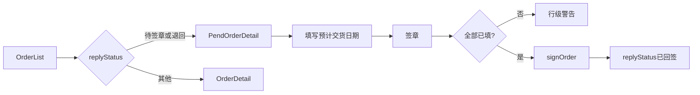

# PendOrderDetail 待签章详情页

## 决策（已确认）

- **入口**：[`OrderList.vue`](source/src/views/supplier/OrderList.vue) 按状态分流——`replyStatus` 为 `待签章` / `退回` → `PendOrderDetail`；其余仍进现有 `OrderDetail`
- **提交**：主按钮 **签章**；校验每一行 **预计交货日期** 后，将回复状态 **`待签章` → `已回签`**（演示简化，不接真实签章 URL）
- **不动** [`OrderDetail.vue`](source/src/views/supplier/OrderDetail.vue)

## 参考映射

| 产品/Demo 用语 | SRM 参考页 |
|---|---|
| 预计交货日期（可编辑） | 供方交期 / `supplierDeliveryTime` |
| 交货日期 / 要求交期（只读） | 要求交货日期 / `requireDeliveryTime` |
| 签章（状态变更） | 签章按钮，非状态下拉 |

数据源：[`srm/tiandy.com/订单明细_20260713142926.xlsx`](srm/tiandy.com/订单明细_20260713142926.xlsx) → 订单号 `POJS2607130002`，8 行物料，供方交期为空。

## 实现要点

### 1. 新页面组件

新增 [`source/src/views/supplier/PendOrderDetail.vue`](source/src/views/supplier/PendOrderDetail.vue)，以 `OrderDetail.vue` 为骨架（同页头/卡片/`el-descriptions`/表格/`SupplierStatusTag`/`DownloadDialog`/`data-rpa` 风格），差异如下：

- Header 主操作：**签章**（替换「下推发货单」）；保留返回列表、下载订单
- 明细表在现有列基础上增加 **预计交货日期**：`el-date-picker`（`type="date"`，`value-format="yyyy-MM-dd"`，placeholder「请选择」），表头带必填 `*`
- 保留只读 **交货日期**（对应要求交期）
- `editable`：`replyStatus === '待签章' || replyStatus === '退回'`；签章成功后日期变只读文本，按钮禁用或改为提示已回签
- 签章校验：任一行未填 → `$message.warning('第N行：预计交货日期字段未填写')`；全部通过后调用 mock API，本地更新 `replyStatus` 为 `已回签` 并成功提示
- RPA：页面标识用独立前缀，如 `pend-order-detail-page`、`pend-order-detail-sign-btn`、行级 date picker `data-rpa`

### 2. 路由与导航

[`source/src/router/index.js`](source/src/router/index.js)：在 `orders/:orderNo` **之前**增加更具体路由，避免被动态段抢占：

```js
{
  path: 'pend-orders/:orderNo',
  name: 'SupplierPendOrderDetail',
  component: () => import('@/views/supplier/PendOrderDetail'),
  hidden: true,
  meta: { title: '待签章订单详情' }
}
```

[`OrderList.vue`](source/src/views/supplier/OrderList.vue) `openDetail`：

```js
const pend = ['待签章', '退回'].includes(row.replyStatus)
this.$router.push({
  name: pend ? 'SupplierPendOrderDetail' : 'SupplierOrderDetail',
  params: { orderNo: row.orderNo }
})
```

[`Navbar.vue`](source/src/layout/components/Navbar.vue)：将 `SupplierPendOrderDetail` 加入订单菜单 `activeNames`，保证详情页高亮「订单」。

### 3. Mock / API

[`source/mock/supplier.js`](source/mock/supplier.js)：

- 新增订单 `POJS2607130002`：`orderDate: '2026-07-13'`，`replyStatus: '待签章'`，`deliveryStatus: '未发货'`，`ownerOrg: '天地伟业技术有限公司'`，`totalAmount` ≈ 84208626.xx（xlsx 价税合计之和），`materialSummary` 取芯片摘要
- 新增 `orderLines.POJS2607130002`：8 行，字段对齐现有 line 结构 + `expectedDeliveryDate: ''`；`deliveryDate` = 要求交货日期；数量/单价/金额/料号等按 xlsx

[`source/src/api/supplier.js`](source/src/api/supplier.js)：

- `fetchOrderDetail` 继续返回 lines（含 `expectedDeliveryDate`）
- 新增 `signOrder({ orderNo, lines })`：校验订单存在 → 写回各行 `expectedDeliveryDate` → 将 `replyStatus` 设为 `已回签` → `mockResponse` 成功（内存态即可，与现有 mock 一致）

可选：现有 `order_005`（已是待签章）点列表也会进 Pend 页；其 lines 若无 `expectedDeliveryDate`，组件内默认 `''` 即可。

### 4. 流程



## 范围外

- 不实现真实电子签章 URL / 轮询
- 不做管理端「退回」弹窗
- 不把明细表扩成参考页全部 18 列（保持与 `OrderDetail` 列集一致，只加预计交货日期）
- 不修改 `OrderDetail.vue` 行为与文案
